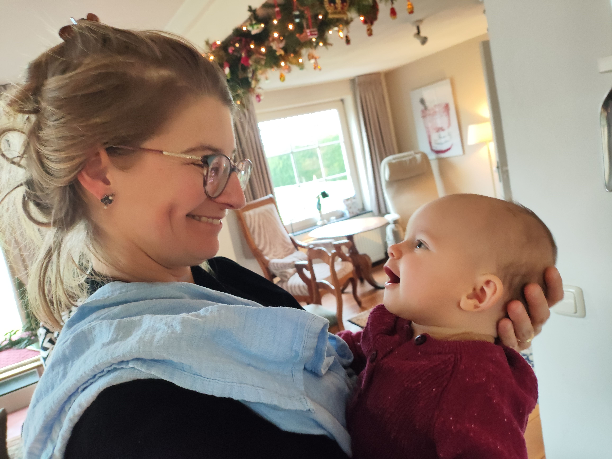

- Eigenlijk ziet dit er prima uit.
- Tijd? 05:41
- 05:42 Is dit inklapbaar? Ik denk van wel. Vreemd dat getik hier in huis
- 05:44 Hier iets onder
  collapsed:: true
	- Bijvoorbeeld een lijstje
		- LATER tanden poetsen
		  :LOGBOOK:
		  CLOCK: [2024-12-29 Sun 05:46:21]--[2024-12-29 Sun 05:46:33] =>  00:00:12
		  CLOCK: [2024-12-29 Sun 05:46:36]--[2024-12-29 Sun 06:17:48] =>  00:31:12
		  :END:
- 05:46
- 06:03
	- 
- 06:38 nu 5 blz Dahl
  id:: 6770e05c-2d61-4d26-91c1-20c2d15d2d58
  collapsed:: true
	- 06:47 p. 38
	- 06:51 p. 39
	- 06:56 p. 40
	- 06:59 p. 41
	- 07:03 p. 42
	- 07:06 p. 43
	- 07:08 p. 44
- **06:42** [[quick capture]]:  [Onboarding: Learn the fundamentals of Logseq in 70 minutes – Logseq Community Hub](https://hub.logseq.com/getting-started/uQdEHALJo7RWnDLLLP7uux/onboarding-learn-the-fundamentals-of-logseq-in-70-minutes/iPUPLPx7dZgPuASHtqNu2m)
- 07:55 wel interessant deze tutorial.
  collapsed:: true
	- ((6770f400-3dcc-4f87-96c8-37efddeb387c))
- 08:05 ziet er niet slecht uit
  collapsed:: true
	- Elke gedachte in een apart blok
	- Alle notities/gedachten gewoon op de journaalpagina
	- Eigenlijk het search dont sort principe
	- Wel een beetje wennen
	- Vandaag gaan we twee dingen doen:
		- Verjaardag Paul
		- Leesclub
- 11:14 even de Volkskrant
- ## 15:27 lezen en nap
  collapsed:: true
	- Wat komt hier
- ## 16:03 nog een letter lezen
- 16:17 nu naar Zwolle
- De idioot in bad Vasalis
- Leesboek leesclub
	- Peri callosa Evelyn Roll 
	  #+BEGIN_IMPORTANT
	  Deze wordt het
	  #+END_IMPORTANT
	- Nirwana Tommy Wieringa
- 23:32 Eigenlijk wel tevreden over deze dag. Misschien nog even dagboek.