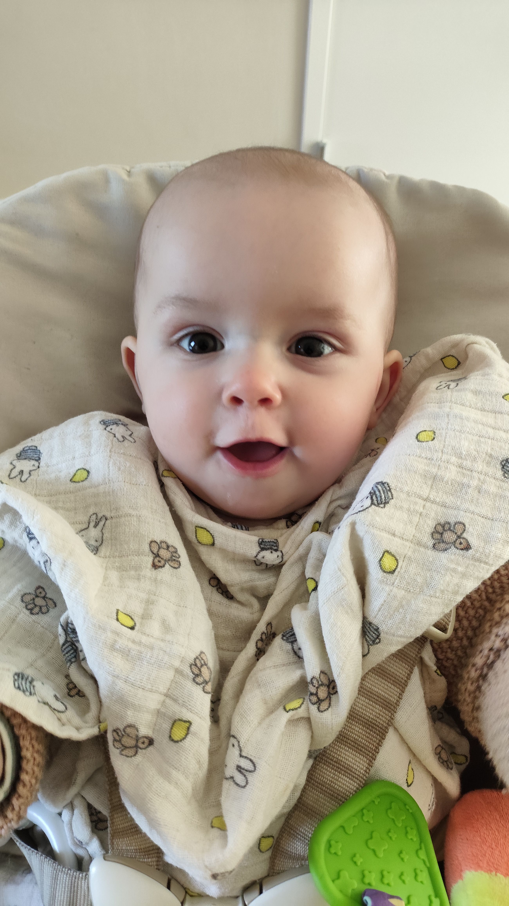
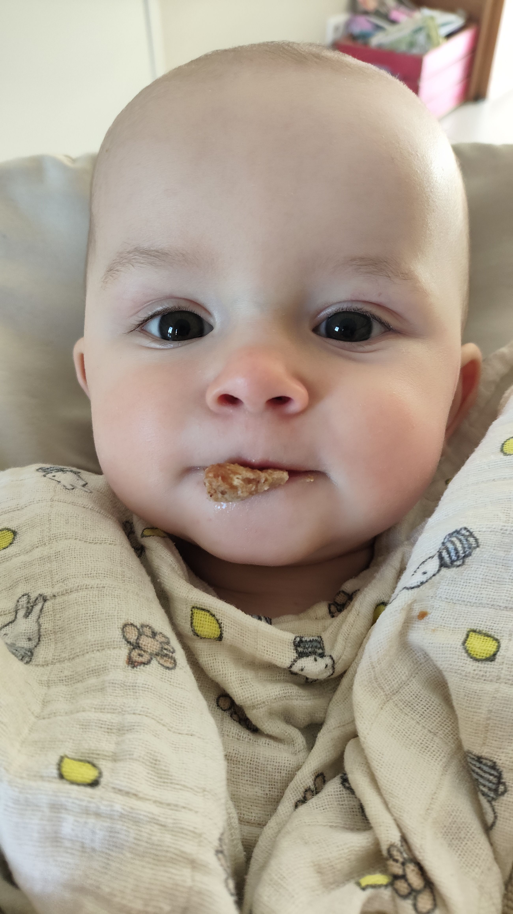
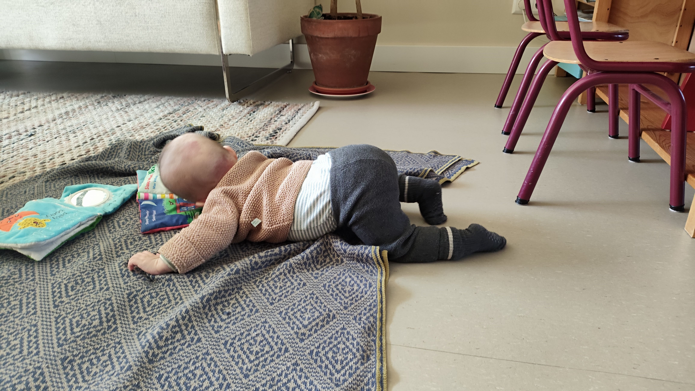
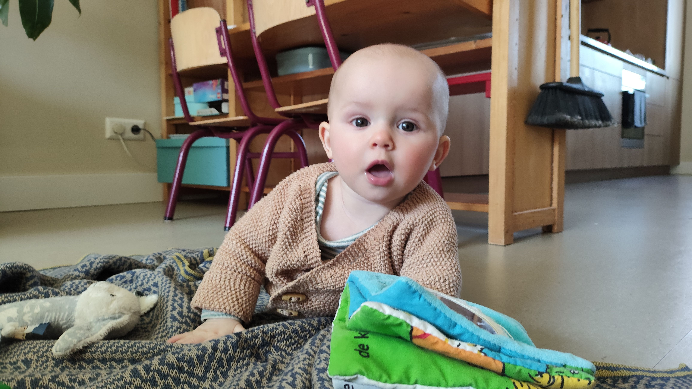

- De eerste dag van de lente! En wat voor een dag! Zon, 20°, zacht windje, heerlijk!
- Gisteren hebben we weer opgepast. Je was een beetje ongedurig, we wisten eerst niet goed wat je dwars zat. Maar op een zeker moment was het duidelijk: je had gewoon een enorme honger! De flessen gingen er vlot in. Eerste een halve geprakte banaan en meteen de andere helft er achter aan! De boterham met pindakaas ging er nog niet zo vlot in, maar dat gaat vast snel komen. Even een paar foto's.
- 
- 
- 
-
- Warempel, het lijkt wel of je begint te kruipen!
- Het is ontzettend leuk om te zien hoe je met een vriendelijke en ontspannen maar ook geïnteresseerde gezichtsuitdrukking steeds oogcontact probeert te maken met iedereen in je omgeving.
- 
-