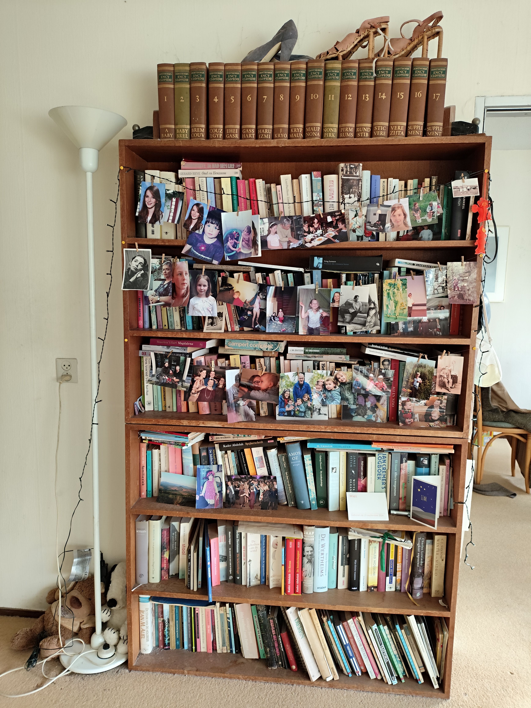
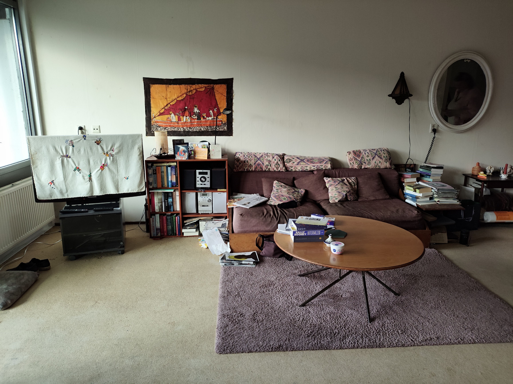

- Vannacht is onze Gerrie overleden, 91 jaar oud. Ze is rustig in bed in haar slaap overleden. De dekens lagen netjes opgemaakt over haar heen. Dan hoop je toch dat ze mag rusten in vrede.
- Gerrie laat een grote lege plek achter. Anne bezocht haar elke maandag, Cathrien vaak op dinsdag, Sara op woensdag, Toon op vrijdag. Ze heeft in november nog een paar weken hier gelogeerd toen in haar appartement de voor- en achtergevel werden vervangen.
- De foto's in haar kamer vertellen wie en hoe ze was
- 
- 
- 
- 
- 
- 
- **15:37** [[quick capture]]:  https://u.pcloud.link/publink/show?code=XZuNnJ5ZVspg7k1mGfRAI8FWnvY6t5E4oT7khttps://www.kozco.com/tech/piano2-CoolEdit.mp3
-
- <audio controls> <src="https://u.pcloud.link/publink/show?code=XZuNnJ5ZVspg7k1mGfRAI8FWnvY6t5E4oT7k"> </audio>
-
-
-
-
-
-
-